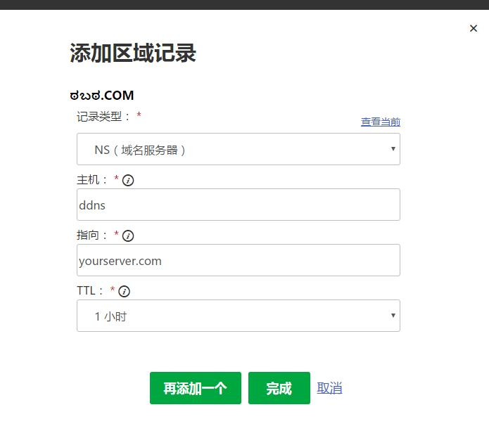
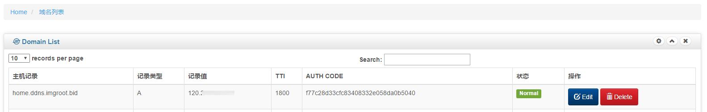

# 使用方法
## 部署NSServer
详见ownnet/ddns_nsserver仓库
## 部署WebServer
详见ownnet/ddns_webserver仓库
## 本地客户端安装
详见ownnet/ddns_client_py仓库
## 配置
### 添加NS记录
在域名服务商的dns区域中新增一条NS记录，主机名称为想要解析的二级域名名称，若该域名下所有请求均交由自建NS服务器解析，此处填@；“指向”填写运行该NS服务器的主机的ip或域名  

记录生效后，所有对ddns.yourserver.com域名及其子域名的访问，都将交由yourserver.com上运行的NS服务器解析。  
如果想要将域名yourserver.com全部交由该服务处理，可直接修改域名本身的NS记录
### 后台设置
在完成部署后，输入http://your.webdomain.com/ 登陆；默认数据库中已有一个用户名密码均为amin的用户，请在第一时间修改密码
单击左侧菜单-域名管理-添加新域名创建一个二级（或更多级）的域名。主机记录中填写完整的域名。例如home.ddns.yourserver.com，记录值留空，单击提交。
在/domain/list中（域名管理-域名列表）中查看当前域名(我以home.ddns.imgroot.bid为例)

### 使用客户端
三种方法：  
1. 默认的safe模式  
`python3 console.py -1 -t safe -d home.ddns.imgroot.bid -c f77c28d33cfc83408332e058da0b5040`  
2. 用户名密码模式  
`python3 console.py -1 -t username -d home.ddns.imgroot.bid -u admin -p admin`  
3. 域名授权码模式  
`python3 console.py -1 -t authcode -d home.ddns.imgroot.bid -c f77c28d33cfc83408332e058da0b5040`

如果您使用群晖，请参考文档02 [在群晖中使用](./use_in_Synology.md)