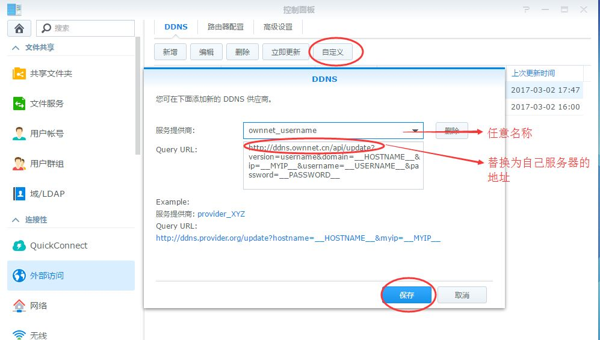
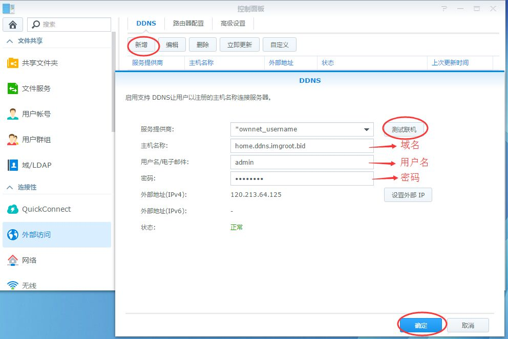
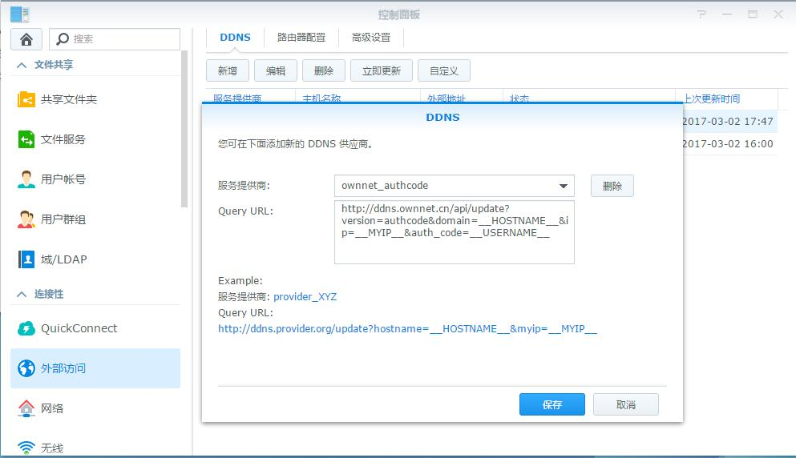
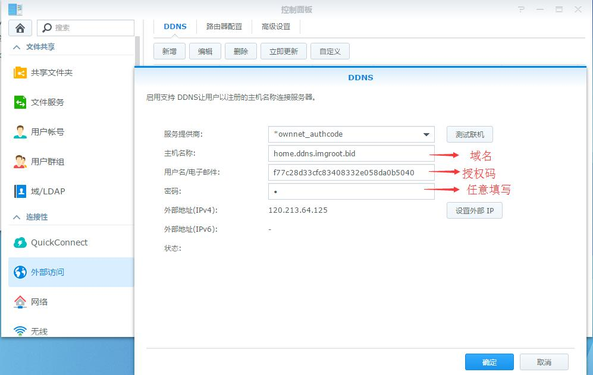

# 在群晖中使用

## 添加自定义服务器 
### 方法一：使用用户名和密码
Step1:在控制面板-外部访问-DDNS选项卡中单击“自定义”,DDNS供应商名称任意，Query URL填写`http://ddns.ownnet.cn/api/update?version=username&domain=__HOSTNAME__&ip=__MYIP__&username=__USERNAME__&password=__PASSWORD__`（将其中的`ddns.ownnet.cn/api`部分替换为自己服务器的地址），并单击保存  
  
Step2：
Step1:在控制面板-外部访问-DDNS选项卡中单击“新增”，选择刚才添加的服务提供商，主机名称填写需要更新的域名，用户名，密码填写该域名所属用户的用户名及密码，单击"测试联机"，若状态显示未"正常"则表示服务器及设置均正常；若提示错误，可直接构造该url查看返回值以排查问题。
  

### 方法二：使用域名授权码
设置方法同上：Query URL为：
`http://ddns.ownnet.cn/api/update?version=authcode&domain=__HOSTNAME__&ip=__MYIP__&auth_code=__USERNAME__` 
  
  
备注：该方法仅需要提供主机名称及授权码即可，因为群晖客户端要求密码必须填写密码。此处随意填写即可，并不会被提交至服务器。